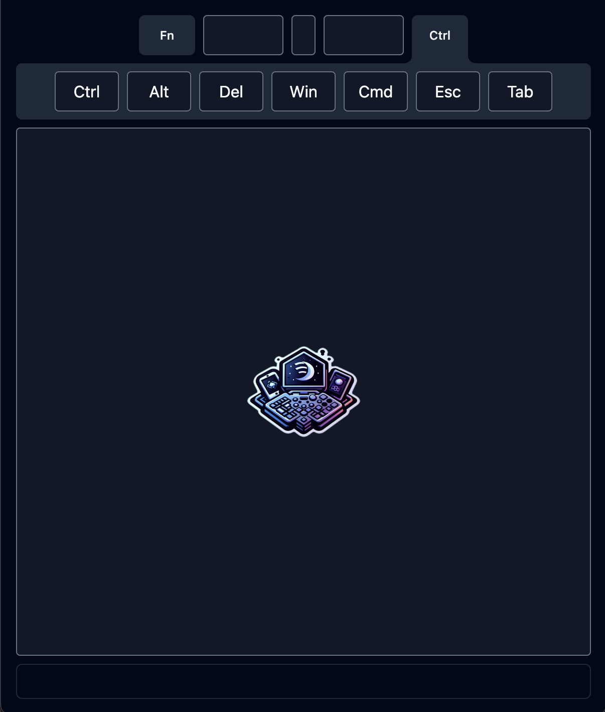

<p align="center">
  
</p>
<h1 align="center">PC Companion</h1>

## What is PC Companion?

<p align="center">
PC Companion is program that allows you to control your PC (Windows, Mac, Linux) via a local webapp.
</p>

<p align="center">
  
</p>

## Why?

I like to game on my PC using a controller in a comfy recliner and have had issues with wireless keyboards. There are many remote PC controller apps out there but many paywall certain mouse/keyboard interactions and are closed source (who knows what they are recording...). This application runs entirely on your local network and the code you clone is the code that's run.

## How to use

### Requirements

<a href="https://bun.sh/">Bun</a>= v1.1.7

### Clone, Build, Run

1. `git clone https://github.com/ZachJW34/pc-companion.git && cd pc-companion`

2. `bun install`

3. `bun run build`

4. `bun run start`

A local server is now running, visit the url printed in the terminal output and control your PC remotely!

## Development

```sh
bun run dev
```

This will spawn two processes, the bun server that listens to WebSocket messages and the frontend server (Vue + Vite).

The Vite server can be accessed from any device on your local network by visiting `http://<host-ip>:<port>`.

### Contributions Welcome!!!

If you find any issues, feel free to post an issue. If you want to contribute, fork the repo and open a pull request.
